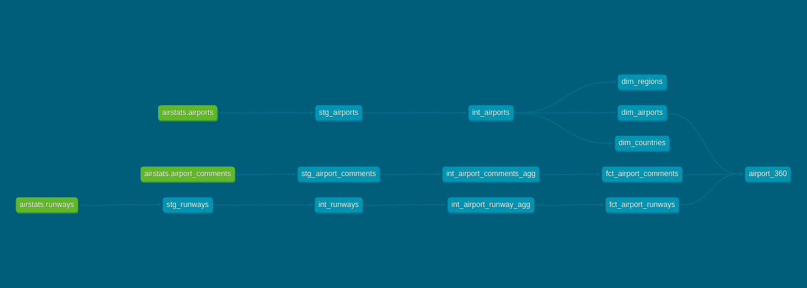

# Airport Data Analytics DBT Project

## Project Overview
This is a capstone project from the [Udemy Complete dbt Data Build Tool Bootcamp: Zero to Hero](https://www.udemy.com/course/complete-dbt-data-build-tool-bootcamp-zero-to-hero-learn-dbt/).  
The data is from [OurAirports.com](https://ourairports.com).  

The dataset includes:
- **72,000 airports**
- **44,000 runways**
- **15,000 user comments**

The goal is to build clean, analytical-ready tables in **Snowflake**, enabling analysis of airport capabilities, runway infrastructure, and user engagement.

---

## Objectives
- Transform raw airport, runway, and comment data into business-ready models.
- Build staging → intermediate → marts layers.
- Provide reusable fact and dimension tables for data science or dashboarding tasks.
- Comprehesive testing
---

## Data Sources
| Source | Description |
|--------|-------------|
| Airports | Metadata including codes, location, and scheduled service. |
| Runways | Runway characteristics (length, width, surface, lighting, thresholds). |
| Airport Comments | User feedback including subject, body, and timestamps. |

---

## Project Structure
models/
- staging/ -- Clean raw data and standardize columns
- intermediate/ -- Transformations and aggregations
- marts/ -- Business-facing fact/dimension tables

---

## Key Models
- **dim_airports** – Cleaned airport dimension table
- **fct_airport_runways** – Aggregated runway metrics per airport
- **fct_airport_comments** – User engagement metrics per airport
- **airport_360** – Fully joined table combining airports, runways, and comments


---

## Data Flow / DAG


---

---

## How to Run
```bash
# Run all models
dbt run

# Test models
dbt test

# Generate documentation
dbt docs generate
dbt docs serve